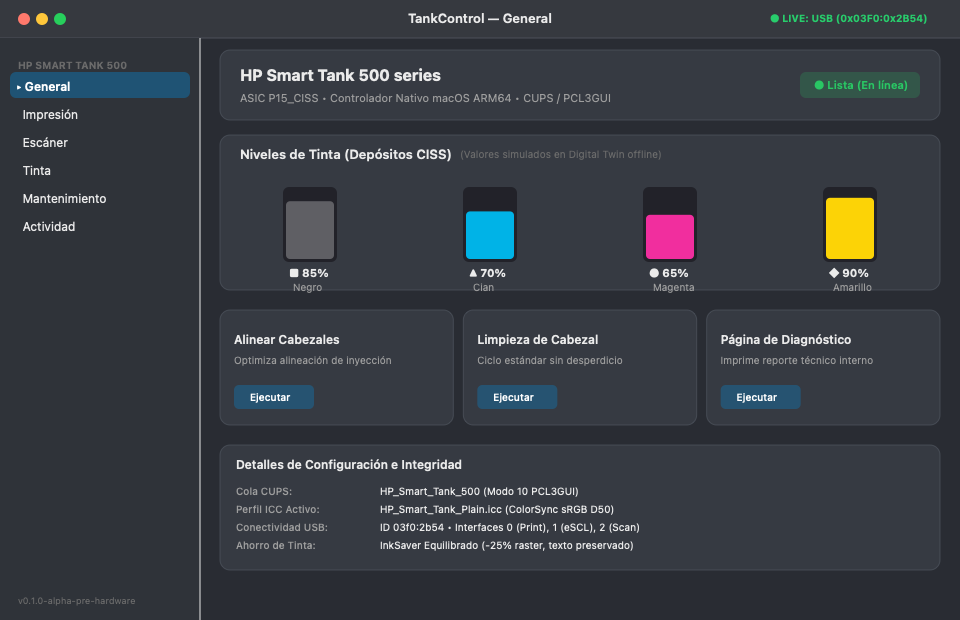
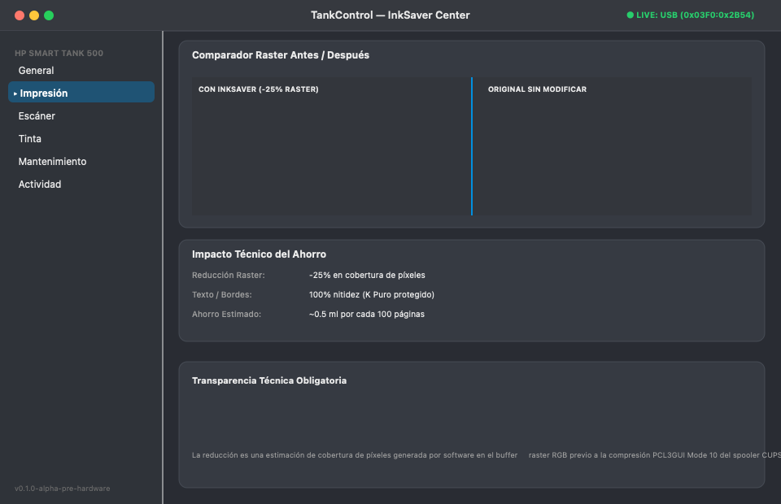

# TankControl

**Native printing, scanning & ink management for macOS (Apple Silicon ARM64)**  
*Compatible con HP Smart Tank 500 Series (`0x03F0:0x2B54`)*

---

[](#)
[](#)
[](LICENSE)
[](#)
[](#)
[](#)
[-success.svg)](#)

---

## 1. Visión General

**TankControl** es una solución integral y de código abierto para operar impresoras y escáneres multifunción de tanque continuo (CISS) en macOS moderno sobre arquitectura ARM64 (Apple Silicon M1/M2/M3/M4). 

Diseñado específicamente para sustituir aplicaciones comerciales pesadas por un entorno nativo en SwiftUI y C puro, sin requerir cuentas de usuario, sin servicios en la nube y con estricta transparencia técnica.

### Vistas Principales

| Panel de Control y Depósitos CISS | InkSaver Center & Comparador Visual |
| :---: | :---: |
|  |  |

---

## 2. Características Principales

### Impresión y RIP Nativo
* **Filtro CUPS Optimizado (`rastertopcl3gui`):** Codificador nativo PCL3GUI Mode 10 con soporte de compresión run-length, calibración de dot gain y tramado adaptativo en C99 puro para Apple Silicon.
* **Modo Rápido Borrador (Fast Draft):** Impresión de alta velocidad a 300 DPI con comando PCL de cabezal `\033*o1M` y ahorro de tinta del 70% (Eco70), conmutable en 1 solo clic desde la app o mediante CUPS.
* **Canal Negro Puro (`PureBlack`):** Evita el consumo parasitario de tintas de color CMY al imprimir texto y documentos monocromáticos.
* **Perfiles ColorSync Calibrados:** Perfiles ICC dedicados para papel común, satinado fotográfico y mate.

### InkSaver Center & Transparencia
* **Control Deslizante Continuo (0% a 75%):** Graduación fina en una sola línea continua, inspirada en la clásica utilidad InkSaver pero implementada nativamente en el motor RIP de macOS.
* **Tecnología EdgePreserve™:** Mantiene los contornos tipográficos y el texto negro 100% nítidos mientras atenúa inteligentemente fondos e ilustraciones.
* **Comparador Visual Impreso Antes / Después:** Previsualización dinámica de la densidad del documento en tiempo real con tirador divisor `<->`.
* **Aviso Honesto:** Declara explícitamente que la reducción es una estimación sobre el buffer raster RGB de software previo al spooler, sin fingir telemetría de sensores piezométricos no existentes.

### Escaneo Óptico y AirScan
* **Driver de Escáner Dedicado (`hp_scan`):** Comunicación sobre la interfaz USB secundaria (Vendor Class `0xFF`, Subclase `0x04`, Protocolo `0x01`).
* **Puente eSCL / AirScan:** Compatibilidad nativa con la aplicación **Captura de Imagen** (*Image Capture*) y vista previa integrada.

### Accesibilidad y Seguridad de Hardware
* **Diferenciación Geométrica Universal:** Cada depósito CISS se identifica por código, color y una forma geométrica única (Cuadrado para K, Triángulo para C, Diamante para M, Círculo para Y) para usuarios con daltonismo, acompañado de descripciones completas para VoiceOver.
* **Aislamiento de Operaciones Peligrosas:** Las rutinas con alto consumo de tinta o desgaste mecánico (Purga Profunda Nivel 2, Cebado Forzado CISS, Inyección RAW) están confinadas tras el interruptor de **Developer Mode** y protegidas por una hoja modal de confirmación (`ConfirmationSheet`).
* **Gemelo Digital (Modo Mock 100% Offline):** Simulación completa para ejecutar, diseñar y auditar la suite sin hardware físico conectado.

---

## 3. Estructura de la Aplicación

```text
apps/HPSmartTankUtility/Sources/
├── Design/
│   ├── DesignTokens.swift              # Colores, radios, tipografías y espaciados
│   └── Components/
│       ├── StatusBadge.swift           # Pastilla de estado de conexión accesible
│       ├── InkTankGauge.swift          # Calibrador visual acrílico con formas
│       ├── ActionCard.swift            # Tarjeta de acción nativa macOS
│       ├── ConfirmationSheet.swift     # Modal de confirmación ante operaciones críticas
│       ├── DiagnosticRow.swift         # Fila de subsistema expandible
│       ├── MetricCard.swift            # Métrica numérica con SF Pro Rounded
│       └── EmptyStateView.swift        # Estado vacío para vistas sin datos
├── Models/
│   ├── PrinterConnectionState.swift    # Máquina de estados central
│   ├── SupplyItem.swift                # Modelo de suministros CISS con VoiceOver
│   ├── OdometerData.swift              # Telemetría de páginas, escaneos y micro-gotas
│   ├── SmartTankError.swift            # Errores categorizados con guía de solución
│   ├── Preset.swift                    # Perfiles de impresión locales
│   └── DiagnosticItem.swift            # Comprobaciones modulares de salud
├── Services/
│   ├── ProcessRunner.swift             # Subprocesos seguros sin shell (no sh -c)
│   ├── SmartTankServiceProtocol.swift  # Interfaz abstracta de hardware
│   ├── MockSmartTankService.swift      # Gemelo digital offline completo
│   ├── RealSmartTankService.swift      # Driver de producción con helpers locales
│   ├── PrinterManager.swift            # Estado observable central y sondeo adaptativo
│   ├── PrinterService.swift            # Gestión de colas CUPS y presets
│   ├── ScannerService.swift            # Control óptico de escáner y eSCL
│   ├── InkSaverService.swift           # Motor de cálculo de ahorro raster
│   └── NotificationManager.swift       # Notificaciones macOS sin spam
├── Views/
│   ├── MainSplitView.swift             # Barra lateral estilizada y contenedor
│   ├── DashboardView.swift             # Panel de inicio, tanques CISS y acciones
│   ├── PrintCenterView.swift           # Presets de impresión y cola CUPS
│   ├── ScannerView.swift               # Ajustes de digitalización y previsualización
│   ├── InkSaverCenterView.swift        # Comparador interactivo y calculadora
│   ├── StatusView.swift                # Odómetro profundo y lectura de gotas
│   ├── MaintenanceView.swift           # Mantenimiento seguro vs Developer Mode
│   ├── DiagnosticsView.swift           # Chequeo del sistema y exportación de reportes
│   ├── HistoryView.swift               # Historial de trabajos 100% privado
│   ├── SettingsView.swift              # Preferencias y conmutador Developer Mode
│   ├── OnboardingView.swift            # Asistente de bienvenida de 5 pasos
│   ├── HelpView.swift                  # Árbol de resolución de incidencias
│   ├── PrivacyView.swift               # Manifiesto de cero telemetría
│   └── AboutView.swift                 # Créditos y notas de versión
└── main.swift                          # Punto de entrada y monitor de Barra de Menú
```

---

## 4. Compilación y Ejecución

### Requisitos
* Mac con procesador Apple Silicon (M1, M2, M3, M4 o variantes Pro/Max/Ultra).
* macOS 12.0 Monterey o superior.
* Herramientas de línea de comandos de Xcode (`swiftc`, `clang`).

### Instalación para Usuarios (Releases)
Descarga la última imagen de disco `.dmg` desde la sección de Releases:
1. Abre `HP_Smart_Tank_500_macOS_Instalador.dmg`.
2. Ejecuta `Instalador HP Smart Tank 500.pkg` para configurar el controlador nativo y CUPS en macOS.
3. Arrastra `TankControl.app` a la carpeta `Aplicaciones`.

### Construcción desde Código Fuente
```bash
# Compilar la aplicación SwiftUI nativa:
./apps/HPSmartTankUtility/build_app.sh

# Construir paquete instalador .pkg oficial:
./package_dist.sh

# Generar la imagen de disco .dmg completa:
./package_dmg.sh
```

### Ejecutar Suite Completa de Pruebas Automatizadas
```bash
python3 -m unittest discover -s tests -v
```
*(Más de 200 pruebas automatizadas cubriendo filtros RIP C99, PCL3GUI Mode 10, InkSaver, seguridad de buffer, topología USB, eSCL y arquitectura).*

---

## 5. Documentación de Referencia

* [`docs/BRAND-GUIDE.md`](docs/BRAND-GUIDE.md): Guía canónica de marca, paleta, tipografía e iconografía.
* [`docs/APP-DESIGN-SYSTEM.md`](docs/APP-DESIGN-SYSTEM.md): Especificación exhaustiva del sistema de diseño y componentes.
* [`docs/APP-INFORMATION-ARCHITECTURE.md`](docs/APP-INFORMATION-ARCHITECTURE.md): Árbol de navegación y flujos de usuario.
* [`docs/APP-UX-AUDIT.md`](docs/APP-UX-AUDIT.md): Auditoría de la utilidad monolítica original y deuda técnica solventada.
* [`docs/APP-SANDBOX-ASSESSMENT.md`](docs/APP-SANDBOX-ASSESSMENT.md): Evaluación de App Sandbox vs acceso a sockets CUPS y USB.
* [`docs/TROUBLESHOOTING-TREE.md`](docs/TROUBLESHOOTING-TREE.md): Árbol determinista de resolución de problemas offline.

---

## 6. Aviso Legal y Descargo de Responsabilidad

**HP®**, **Smart Tank®**, **DeskJet®** y los números de modelo asociados son marcas comerciales registradas propiedad de **HP Inc.**  

**TankControl** es un desarrollo independiente de código abierto, distribuido bajo licencia permisiva. No mantiene relación comercial, patrocinio, afiliación ni respaldo oficial por parte de HP Inc. La mención de marcas y modelos específicos se efectúa exclusivamente con carácter nominativo y descriptivo para indicar la compatibilidad técnica del controlador.
