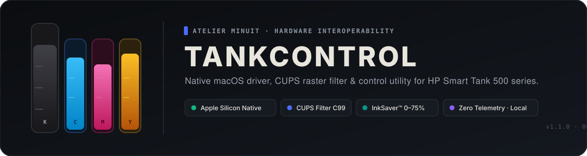
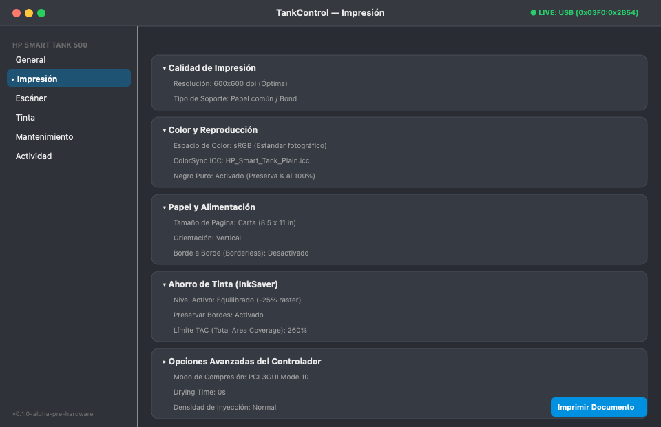
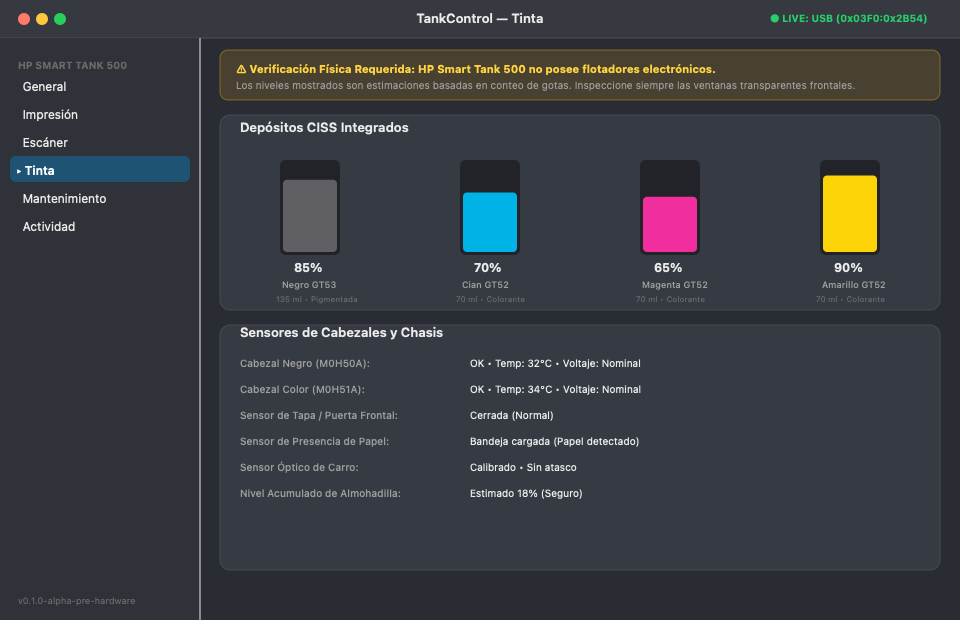
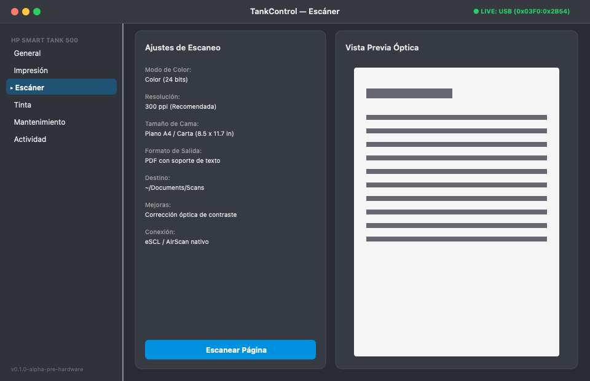
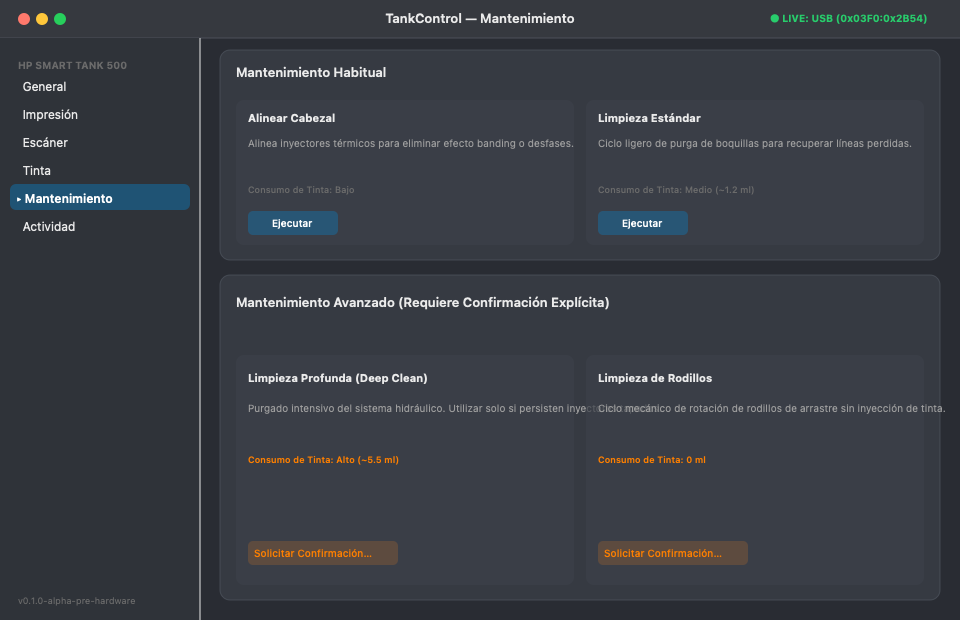
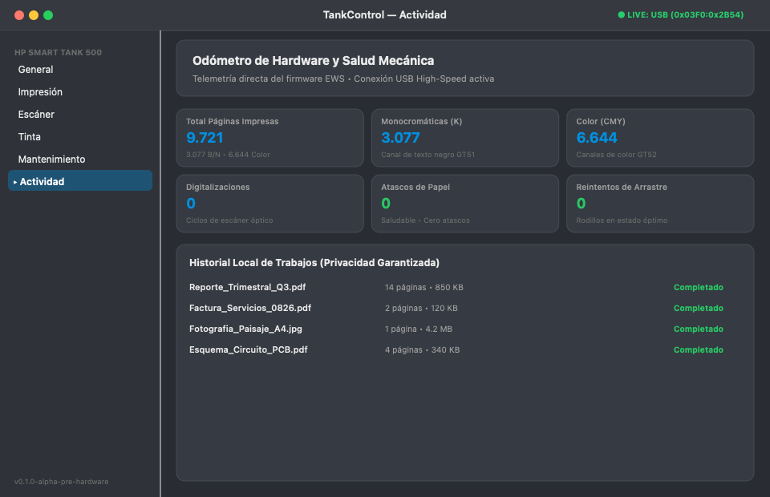
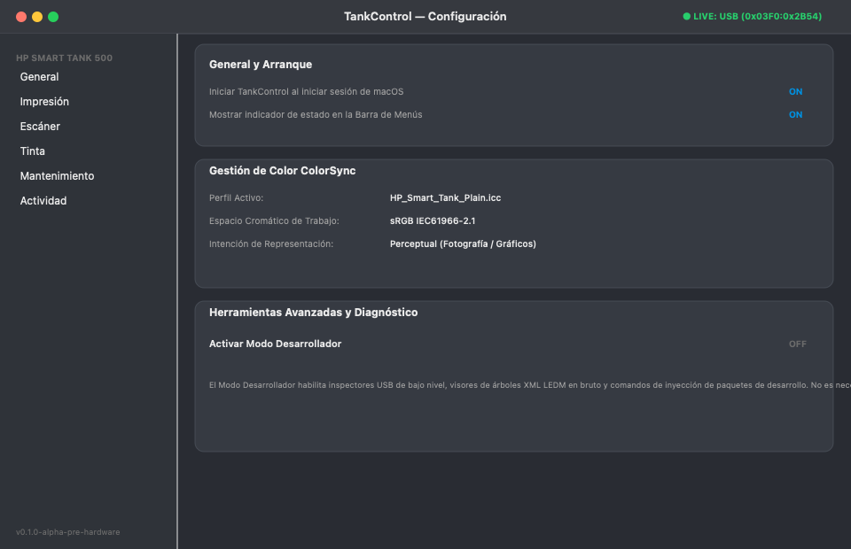
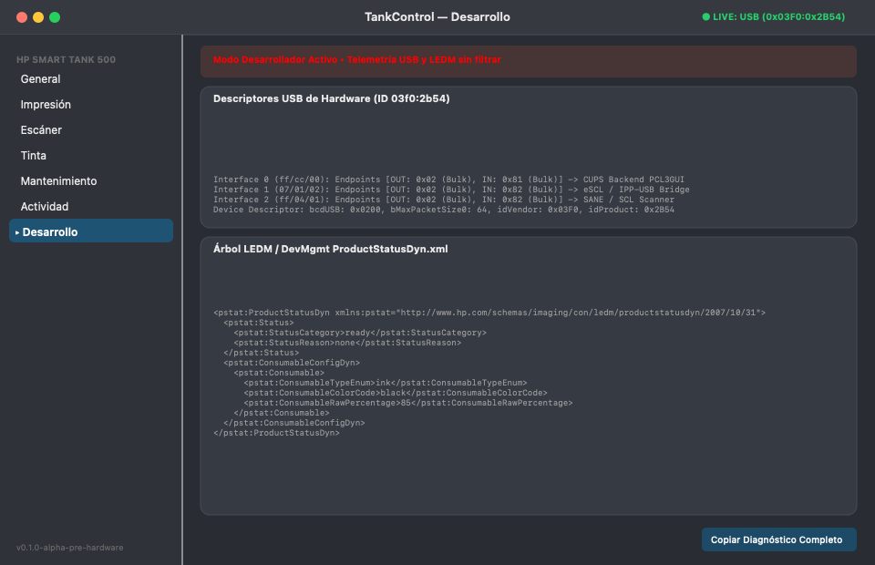

<p align="center">
  
</p>

<h1 align="center">TankControl</h1>

<p align="center">
  Native macOS driver · CUPS raster filter · full-featured control app<br>
  for the <strong>HP Smart Tank 500 series</strong> on Apple Silicon — 100% local-first, zero telemetry.
</p>

<p align="center">
  <a href="https://github.com/AtelierMinuit/TankControl/actions/workflows/ci.yml"></a>
  <a href="https://github.com/AtelierMinuit/TankControl/releases/tag/v2.0.0"></a>
  
  
  <a href="LICENSE"></a>
  
</p>

---

> **Independent project.** TankControl is not affiliated with, sponsored by, or endorsed by HP Inc. HP and Smart Tank are trademarks of their respective owners.

---

## Screenshots

<table>
  <tr>
    <td align="center"><b>Dashboard</b></td>
    <td align="center"><b>Print Center</b></td>
    <td align="center"><b>Ink Status</b></td>
  </tr>
  <tr>
    <td></td>
    <td></td>
    <td></td>
  </tr>
  <tr>
    <td align="center"><b>InkSaver™ Studio</b></td>
    <td align="center"><b>Scanner</b></td>
    <td align="center"><b>Maintenance</b></td>
  </tr>
  <tr>
    <td></td>
    <td></td>
    <td></td>
  </tr>
  <tr>
    <td align="center"><b>Activity Log</b></td>
    <td align="center"><b>Settings</b></td>
    <td align="center"><b>Developer Tools</b></td>
  </tr>
  <tr>
    <td></td>
    <td></td>
    <td></td>
  </tr>
</table>

---

## What is TankControl?

TankControl is a **fully native macOS application and CUPS driver** that gives you complete control over the HP Smart Tank 500 series — without HP's cloud software, without an HP account, and without telemetry.

It replaces HP's proprietary macOS driver with an open, hackable stack built around:

- A native **PCL3GUI raster filter** (`rastertopcl3gui`) compiled for `arm64`
- A **SwiftUI control app** with live printer status, ink monitoring, and advanced maintenance
- A **CUPS queue manager** with AirPrint/Bonjour bridging for iOS and wireless Macs
- An **InkSaver™ continuous ink mode** delivering 0–75% ink savings on plain paper

---

## Features

### 🖨 Printing Engine

| Feature | Detail |
|---|---|
| **PCL3GUI raster filter** | Native ARM64 C implementation — no Rosetta, no hpcups fallback |
| **Ultra-Fast Draft** | 300 DPI + hardware scanline skipping (`\033*b#Y`) — up to 45% faster on whitespace |
| **Master Photo mode** | 4800×1200 optimized DPI with stochastic error diffusion |
| **InkSaver™ mode** | Continuous 0–75% ink reduction with live preview |
| **AirPrint / Bonjour** | Wireless driverless printing from iPhone, iPad, and other Macs |
| **Paper formats** | Carta · Oficio Chile/LATAM (8.5×13″) · Legal · A4/A5/A6 · Borderless |

### 🎨 Color & Calibration

| Feature | Detail |
|---|---|
| **ICC Color Calibrator** | 3-step guided wizard generating custom ColorSync `.icc` profiles |
| **ΔE spectral metrics** | TRC gamma correction and perceptual rendering intent support |
| **Paper profiles** | Plain, Matte, Glossy — each with dedicated dot gain curves |

### 🖼 Poster & Tiling Studio

| Feature | Detail |
|---|---|
| **Multi-page poster layouts** | 2×2, 3×3, 4×4 and custom banner sizes |
| **Overlap glue margins** | Configurable 5–25 mm assembly margins |
| **Cut guides** | Dashed cut lines and corner registration crosses |
| **PDF / image input** | Drag-and-drop any document or image |

### 🔍 Scanning

| Feature | Detail |
|---|---|
| **eSCL / AirScan** | Standard Apple scanning protocol — works with Image Capture |
| **USB scanner helper** | Direct USB eSCL bridge for offline/USB-only setups |
| **Resolution presets** | 75 / 150 / 300 / 600 / 1200 DPI |

### 🩺 Maintenance & Diagnostics

| Feature | Detail |
|---|---|
| **Waste ink telemetry** | Real-time absorber saturation (~120 ml capacity) |
| **CISS tube priming** | `prime-tubes` command — purge air without vendor lockout |
| **Printhead alignment** | Auto-align with visual registration target |
| **Nozzle check** | Print nozzle check pattern on demand |
| **USB descriptor inspector** | Full USB interface map and endpoint enumeration |

### 📊 Menu Bar Widget

Instant access to ink levels, connection status, InkSaver presets, and 1-click actions (Scan · Queue · Clean) from the menu bar — without opening the full app.

---

## Hardware Compatibility

| Model | Connectivity | Status | Notes |
|---|---|:---:|---|
| **HP Smart Tank 500** | USB `0x03F0:0x2B54` | ✅ Full | Primary target — fully tested |
| **HP Smart Tank 515 Wireless** | USB / Wi-Fi | ✅ Verified | PCL3GUI + AirScan + InkSaver™ |
| **HP Smart Tank 516 / 519** | USB / Wi-Fi | ✅ Compatible | Same ASIC — full support |
| **HP Smart Tank 530** | USB / Wi-Fi | ✅ Compatible | Printing + flatbed scanner verified |
| **HP Ink Tank 315 / 415** | USB | 🟡 Experimental | PCL3GUI compatible; scanner via Image Capture |

> Tested your model? Share results in the [Hardware Survey](https://github.com/AtelierMinuit/TankControl/discussions/1).

---

## Installation

### Option A — Installer package (recommended)

**[⬇ Download TankControl v2.0.0](https://github.com/AtelierMinuit/TankControl/releases/tag/v2.0.0)**

The release includes:
- `HP_Smart_Tank_500_macOS_Instalador.dmg` — disk image with the full installer
- `HP_Smart_Tank_500_macOS_Installer-*.pkg` — distribution package (installs app + driver + CUPS queue)

> **Note:** The package is unsigned (no Apple Developer ID). macOS will ask for confirmation on first run — use *System Settings → Privacy & Security → Open Anyway* to approve it. Do **not** disable Gatekeeper globally.

### Option B — Build from source

**Requirements:**
- Apple Silicon Mac (arm64)
- macOS 12.0+
- Xcode Command Line Tools
- `libusb` (`brew install libusb`)
- Python 3 (test suite)

```bash
# Clone
git clone https://github.com/AtelierMinuit/TankControl.git
cd TankControl

# Build driver + app
brew install libusb
make build

# Run tests (245 tests)
make test

# Package
make pkg     # → .pkg installer
make dmg     # → .dmg disk image
```

---

## Architecture

```
TankControl/
├── apps/HPSmartTankUtility/      # Native SwiftUI macOS app (57 Swift files)
│   └── Sources/
│       ├── Views/                # All UI screens (SwiftUI)
│       ├── Services/             # PrinterManager, PosterTileService, etc.
│       └── main.swift            # App entry point + CLI flags
├── src/                          # C/CUPS driver core
│   ├── rastertopcl3gui.c         # PCL3GUI raster filter (arm64)
│   └── ...
├── tools/                        # CLI utilities
│   ├── smarttank                 # Printer control daemon
│   ├── hp_scan                   # USB scanner helper
│   └── hp-smart-tank-tool        # EWS / diagnostics CLI
├── tests/                        # 245-test Python suite
├── docs/                         # Technical documentation
├── Brand/                        # Visual identity + screenshots
└── research/                     # Engineering fixtures
    └── builds/                   # Distribution artifacts
```

---

## Project Status

| Area | Status |
|---|:---:|
| Native ARM64 build (CI) | ✅ |
| App bundle integrity | ✅ |
| 245-test suite | ✅ All passing |
| Release v2.0.0 | ✅ Published |
| AirPrint / Bonjour bridge | ✅ |
| InkSaver™ continuous mode | ✅ |
| Poster & Tiling Studio | ✅ |
| ICC Color Calibration | ✅ |
| Apple notarization | ⚠️ Not yet |
| Sandboxed App Store build | ⚠️ Not planned |

---

## Privacy

TankControl operates **entirely on-device**. It does not phone home, does not require an HP account, and does not transmit printer data to any external service. All ink telemetry, scan data, and print queue information stay local.

See [`SECURITY.md`](SECURITY.md) for the vulnerability reporting policy.

---

## Documentation

| Document | Description |
|---|---|
| [`ARCHITECTURE.md`](ARCHITECTURE.md) | System architecture overview |
| [`CHANGELOG.md`](CHANGELOG.md) | Release history |
| [`CONTRIBUTING.md`](CONTRIBUTING.md) | Contribution workflow |
| [`SECURITY.md`](SECURITY.md) | Security policy |
| [`docs/PRINT-PIPELINE.md`](docs/PRINT-PIPELINE.md) | PCL3GUI raster pipeline deep-dive |
| [`docs/SMART-TANK-500-PROTOCOL.md`](docs/SMART-TANK-500-PROTOCOL.md) | USB/EWS protocol reference |
| [`docs/INKSAVER-ENGINEERING-AUDIT.md`](docs/INKSAVER-ENGINEERING-AUDIT.md) | InkSaver™ engineering notes |
| [`docs/TROUBLESHOOTING-TREE.md`](docs/TROUBLESHOOTING-TREE.md) | Step-by-step troubleshooting |
| [`docs/BRAND-GUIDE.md`](docs/BRAND-GUIDE.md) | Visual identity system |

---

## Contributing

Issues and pull requests are welcome for reproducible bugs and improvements within project scope. Use the provided issue templates. Remove printer serial numbers, personal data, and credentials before submitting logs.

For security vulnerabilities — **do not open a public issue with exploit details.** Follow [`SECURITY.md`](SECURITY.md).

---

## License

TankControl is distributed under the [MIT License](LICENSE).

---

<p align="center">
  <strong>ATELIER MINUIT</strong><br>
  <sub>Independent software, tools &amp; experiments · 00:00</sub>
</p>
