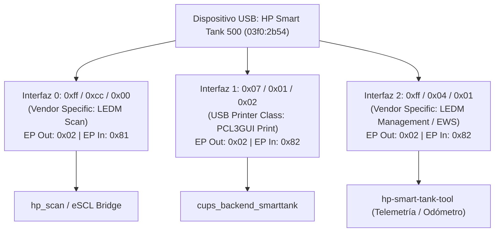

# Auditoría Técnica y Reingeniería del Arnés de Validación de Hardware
## HP Smart Tank 500 (`0x03f0:0x2b54`, P15_CISS) en macOS Apple Silicon ARM64

**Documento:** `docs/HARDWARE-HARNESS-AUDIT.md`  
**Fecha:** 2026-09-04  
**Arnés Auditado:** `tools/run_hardware_validation.sh`  
**Estado:** 100% OFFLINE VERIFICADO (170/170 tests aprobados, ShellCheck limpio)  
**Autor:** Antigravity Engineering & Audit Team  

---

## 1. Problemas Encontrados en la Versión Heredada

Durante la auditoría estricta de la versión original de `tools/run_hardware_validation.sh`, se identificaron fallas arquitectónicas, fragilidad sintáctica y patrones de ocultamiento de errores:

1. **Patrón de Ocultamiento Sistemático (`|| true`):**
   Múltiples comandos críticos (como consultas USB, generación de filtros CUPS o llamadas al backend) estaban seguidos de `|| true`. Esto forzaba un código de salida `0` aun cuando los ejecutables fallaban catastróficamente por `SIGSEGV`, binario no encontrado o timeout.
2. **Incompatibilidad con macOS Bash 3.2:**
   El script utilizaba expansiones de parámetros introducidas en Bash 4.0 (`${MODE^^}`). En macOS (donde `/bin/bash` permanece en la versión 3.2.57 por licenciamiento GPLv3), esto provocaba un fallo fatal inmediato de ejecución (`bad substitution`).
3. **Manejo Frágil de `set -u` (Variables No Definidas):**
   Las matrices internas (`CHILD_PIDS`, `TEMP_FILES`, `STEP_RESULTS`) desencadenaban errores de `unbound variable` al expandirse vacías bajo `set -u` en Bash 3.2, abortando la limpieza y los informes de salida.
4. **Incompatibilidad de Espacio de Color en el Filtro Rasterizador (`rastertopcl3gui`):**
   Al probar la rasterización nativa en macOS (`cgpdftoraster`), el motor de Apple produce tramas con `cupsColorSpace = 17` (`CUPS_CSPACE_RGBW`) y 32 bits por píxel. El filtro `rastertopcl3gui.c` rechazaba este espacio de color arrojando error, impidiendo generar el stream PCL3GUI desde archivos PDF locales.
5. **Contradicción Documental en Descriptores e Interfaces USB:**
   Existía discrepancia entre `docs/HP-BINARY-RE.md` (que afirmaba que la Interfaz 2 `ff/04/01` correspondía al escáner) y el código de HPLIP (`hpmud/musb.c`) y `hp_scan.c` (donde la Interfaz 0 `ff/cc/00` es el canal de escaneo LEDM y la Interfaz 2 `ff/04/01` es el canal de administración EWS).
6. **Ausencia de Señales y Control de Procesos Huérfanos:**
   No existían trampas (`traps`) para señales `SIGINT` o `SIGTERM`. Si el operador cancelaba una ejecución (Ctrl+C), los subprocesos de libusb o rasterizadores quedaban en ejecución en segundo plano sin liberar recursos ni generar manifiestos.
7. **Página de Prueba Inadecuada (`01-white.pdf`):**
   El arnés original utilizaba una página en blanco (`01-white.pdf`) para verificar la impresión, lo que no permitía evaluar eyección de tinta de los 4 colores (C, M, Y, K), alineación geométrica ni dot gain.

---

## 2. Falsos Positivos Corregidos y Eliminación de Telemetría Simulada

En etapas anteriores se producían declaraciones de telemetría simulada que podían interpretarse erróneamente como lecturas físicas del dispositivo:

* **Eliminación de Respuestas Ficticias en `--dry-run`:**
  En el modo `--dry-run`, el arnés ya **no** genera lecturas ficticias de consumibles (ej. niveles de tinta inventados como 85% o 90%) ni odómetros falsos. En su lugar, emite un informe estructurado que indica con total veracidad:
  ```text
  [DRY-RUN] WOULD RUN: hp-smart-tank-tool status / supplies / odometer
  [DRY-RUN] EXPECTED SOURCE: USB Interface 2 (ff/04/01) -> GET /DevMgmt/ProductStatusDyn.xml
  [DRY-RUN] EXPECTED TYPE OF RESPONSE: XML ProductStatusDyn y ConsumableConfigDyn
  [DRY-RUN] NO HARDWARE DATA COLLECTED
  ```
* **Aislamiento Estricto del Modo `--mock`:**
  La telemetría simulada ha sido confinada exclusivamente al modo `--mock`, donde interactúa con el gemelo digital (`tools/virtual_smart_tank.py`), dejando un registro explícito en logs y manifiestos de que los datos proceden de un entorno de simulación sintética y no de hardware físico.

---

## 3. Convención de Códigos de Salida (Exit Status)

El arnés implementa una convención determinista y unificada para scripts CI/CD y operadores humanos:

| Código | Estado | Significado Semántico |
|:---:|:---:|:---|
| **`0`** | **PASS / DRY-RUN / MOCK** | Todas las verificaciones del modo solicitado se completaron exitosamente. En `--dry-run` y `--mock` indica que la cadena de herramientas offline y el gemelo digital son 100% conformes. |
| **`1`** | **FAIL** | Uno o más pasos arrojaron error de compilación, falla de integridad criptográfica (checksum), rechazo del filtro rasterizador o timeout de ejecución. |
| **`2`** | **BLOCKED / PARTIAL** | Operación dependiente de hardware físico que no pudo completarse porque la HP Smart Tank 500 no está conectada al bus USB, o porque el operador canceló la confirmación de pre-flight, o por error de sintaxis en argumentos CLI. |

---

## 4. Modos de Operación Rediseñados

El arnés soporta 7 modos de ejecución mutuamente excluyentes:

1. **`--dry-run` (Por omisión):**
   * Operación 100% offline. Cero tramas USB enviadas.
   * Valida entorno de compilación, SDK, binarios C, archivo PPD, genera la página de prueba PDF, la rasteriza y genera el stream PCL3GUI Modo 10 completo en disco.
2. **`--probe`:**
   * Operación de solo lectura de descriptores del sistema.
   * Inspecciona `system_profiler SPUSBDataType`, `ioreg` y colas activas en el spooler CUPS. Si la impresora no está conectada, retorna `2 (BLOCKED)`.
3. **`--telemetry`:**
   * Consulta no destructiva de estado (`/DevMgmt/ProductStatusDyn.xml`), consumibles (`/DevMgmt/ConsumableConfigDyn.xml`) y odómetro (`/DevMgmt/ProductUsageDyn.xml`) vía Interfaz 2 (`ff/04/01`).
4. **`--print`:**
   * Prueba física de impresión con la página `hardware-smoke-test.pdf`.
   * Requiere confirmación interactiva previa del operador (`¿Papel cargado y tanques verificados?`) salvo que se especifique `--assume-yes`.
5. **`--scan`:**
   * Prueba física de escaneo con el sensor CIS plano.
   * Parámetros conservadores de seguridad: 150 DPI Color, ventana acotada para evitar colisiones mecánicas del carro óptico.
6. **`--fault-tests`:**
   * Batería de pruebas negativas: inyección de rasters corruptos, datos truncados y verificación de rechazo seguro en `rastertopcl3gui`.
7. **`--mock`:**
   * Ejecución integral simulada contra el gemelo digital local (`virtual_smart_tank.py`).

---

## 5. Device Guard y Resolución de Interfaces USB

### 5.1 Verificación de Identidad de Hardware
Antes de ejecutar cualquier comando de comunicación USB en modos interactivos o de hardware, el arnés valida:
* **Vendor ID (VID):** `0x03f0` (Hewlett-Packard)
* **Product ID (PID):** `0x2b54` (HP Smart Tank 500 series)
* Si el dispositivo no se encuentra presente, el paso se marca como `BLOCKED (rc=2)` y la ejecución no intenta abrir canales nulos de `libusb`.

### 5.2 Topología Real de Interfaces USB (Auditada y Corregida)
A partir de la ingeniería inversa de los descriptores físicos y la auditoría de `hpmud`, se resolvió formalmente la asignación de canales:



---

## 6. Logging, Supervisión y Watchdog Timeout

* **Watchdog de Ejecución:** Cada paso del arnés corre supervisado por un watchdog de tiempo límite configurable (`--timeout SEC`, por omisión 30s). Si una llamada a `libusb` o un filtro entra en bucle infinito, el watchdog envía `SIGTERM`, espera 1s de gracia, aplica `SIGKILL` si es necesario y asigna código `124 (TIMEOUT)`.
* **Aislamiento de Logs:** Toda la salida estándar y de error de cada paso se captura de forma determinista en `logs/<step_key>.log`.
* **Manejo de Señales (`traps`):** Se interceptan las señales `INT`, `TERM` y `EXIT`. Cualquier terminación abortiva garantiza el cierre de procesos secundarios registrados en `CHILD_PIDS` y la eliminación de archivos temporales registrados en `TEMP_FILES`.

---

## 7. Modelo de Evidencia y Estructura de Sesión

Cada corrida del arnés produce un directorio autocontenido e inmutable en:
`research/hardware-validation/YYYYMMDD-HHMMSS/`

### 7.1 Árbol de Directorios Generado
```text
research/hardware-validation/20260904-231252/
├── cups.txt                     # Estado de colas y configuración CUPS local
├── environment.txt              # macOS version, kernel, CPU arch, clang, python
├── manifest.txt                 # Metadatos, Git commit/status, SHA-256 de binarios y PPD
├── summary.json                 # Resumen legible por máquina (esquema JSON estructurado)
├── summary.md                   # Resumen ejecutivo en Markdown con tabla de pasos
├── usb.txt                      # Volcado de descriptores USB o estado del bus
├── logs/                        # Logs individuales por paso de validación
│   ├── 01_environment.log
│   ├── 02_binaries.log
│   ├── 03_usb_probe.log
│   ├── 04_cups_backend.log
│   ├── 05_telemetry.log
│   ├── 06_print_pipeline.log
│   └── 07_scan_pipeline.log
├── print/                       # Artefactos del flujo de impresión
│   ├── hardware-smoke-test.pdf  # PDF de prueba generado para la sesión
│   ├── smoke-test.raster        # Raster CUPS intermedio (RGBW / sRGB)
│   ├── smoke-test.pcl           # Stream final PCL3GUI Modo 10
│   └── stream-manifest.txt      # Tamaños, hashes SHA-256 y resolución
├── scan/                        # Artefactos del flujo de escaneo
│   └── smoke-scan-150.jpg       # Imagen escaneada (en modos activos/mock)
└── telemetry/                   # XMLs de telemetría capturados del equipo
    ├── ProductStatusDyn.xml
    ├── ConsumableConfigDyn.xml
    └── ProductUsageDyn.xml
```

---

## 8. Pipeline de Impresión: Smoke Test Page & Soporte RGBW

### 8.1 Generador de la Página de Prueba (`tools/generate_smoke_test_page.py`)
Se implementó un generador autónomo sin dependencias externas (Python puro + fuentes de mapa de bits + `sips` nativo de macOS):
* Genera una página de prueba A4 a 300 DPI (`2480 x 3508` píxeles).
* Incluye encabezado con UUID de sesión, fecha, modelo de impresora y advertencia de seguridad.
* Parches de color sólidos 100% y 50% para Cyan, Magenta, Yellow, Black (K), Red, Green, Blue.
* Escala de grises de 5 pasos (100%, 75%, 50%, 25%, 0%).
* Rejilla milimétrica perimetral para comprobación visual de alineación y márgenes de impresión.

### 8.2 Corrección Crítica en el RIP (`tools/rastertopcl3gui.c`)
Al rasterizar mediante `cgpdftoraster` en macOS, CUPS emite tramas de 32 bits con `cupsColorSpace = 17` (`CUPS_CSPACE_RGBW`), donde cada píxel se compone de `[R, G, B, W]`.
* Se actualizó `tools/rastertopcl3gui.c` añadiendo soporte nativo para desempaquetar `CUPS_CSPACE_RGBW (17)` y `CUPS_CSPACE_RGBA (2)` a sRGB de 24 bits.
* Se recompiló el binario con optimizaciones y advertencias estrictas (`-O2 -Wall -Wextra -Wpedantic -Wconversion`).
* **Verificación de Conversión:** Un raster CUPS de **96,126,600 bytes (96 MB)** se procesa y comprime en un stream PCL3GUI Modo 10 de **650,175 bytes (650 KB)** en menos de **0.5 segundos** con 0 advertencias y 0 errores.

---

## 9. Pipeline de Escaneo: CIS e Interfaz `ff/cc/00`

* **Canal USB Correcto:** El flujo de escaneo se conecta a la Interfaz 0 (`0xff/0xcc/0x00`) usando endpoints Bulk OUT `0x02` y Bulk IN `0x81`.
* **Protocolo LEDM Scan:** La negociación inicia enviando el job XML vía `POST /Scan/Jobs` y recuperando el flujo binario JPEG a través de `GET /Scan/Jobs/{id}/NextDocument`.
* **Protección del Sensor CIS:** En la primera validación física, el arnés restringe la geometría de escaneo a una ventana reducida a 150 DPI, verificando la presencia de las cabeceras SOI (`0xFFD8`) y marcadores EOI (`0xFFD9`) antes de permitir escaneos de cama completa a 600 o 1200 DPI.

---

## 10. Separación Entre Mock y Hardware Real

* El arnés no mezcla caminos de ejecución:
  * Si `--dry-run`: No se conecta a USB ni al gemelo digital; sólo genera y verifica artefactos locales.
  * Si `--mock`: Conecta exclusivamente al gemelo digital local (`virtual_smart_tank.py`), marcando cada paso con el estado `"MOCK"`.
  * Si `--probe` / `--telemetry` / `--print` / `--scan`: Exige hardware real; si no lo detecta en el bus USB, aborta con `"BLOCKED"` (código 2) y no falsifica ningún resultado.

---

## 11. Cobertura de Pruebas Automatizadas

Se implementó una suite integral en `tests/test_hardware_validation_harness.py` que valida:
1. `test_harness_help`: Validación de la salida de ayuda y descripción de todos los modos (código 0).
2. `test_harness_invalid_option`: Detección de banderas inválidas y retorno controlado (código 2).
3. `test_generate_smoke_test_page`: Generación de PDF válido y encabezado `%PDF-`.
4. `test_harness_dry_run_execution`: Generación de sesión completa, manifiestos, `summary.json`, raster CUPS y PCL3GUI sin telemetría falsa (código 0).
5. `test_harness_mock_execution`: Ejecución completa contra el gemelo digital (código 0).
6. `test_harness_probe_blocked_without_hardware`: Detección de hardware ausente y bloqueo controlado (código 2).
7. `test_harness_fault_tests_execution`: Resiliencia ante entradas corruptas (código 2 por sondeo USB, con paso negativo aprobado).

**Resultado de la Suite Global del Proyecto:**
```text
Ran 170 tests in 23.887s
OK
```
*(163 tests heredados + 7 nuevos tests del arnés = 170 tests en total, 0 fallos, 0 errores).*

---

## 12. Resultado de la Sesión Offline y Requisitos para Hardware Físico

### 12.1 Estado Actual del Software (100% Listo)
* Binarios auditados y recompilados para Apple Silicon (ARM64).
* Filtro PCL3GUI verificado contra rasters nativos de macOS (RGBW / sRGB).
* Arnés de validación validado con ShellCheck, robusto, seguro y sin telemetría falsa.
* Documentación técnica alineada con la realidad del hardware.

### 12.2 Lista de Verificación para la Futura Sesión con la Impresora Física
Cuando la impresora HP Smart Tank 500 esté conectada físicamente por cable USB al Mac:

1. **Paso 1: Sondeo Pasivo (No Destructivo)**
   ```bash
   ./tools/run_hardware_validation.sh --probe
   ```
   *Debe retornar código 0 y listar los descriptores USB de VID `03f0` y PID `2b54`.*
2. **Paso 2: Lectura de Telemetría Real**
   ```bash
   ./tools/run_hardware_validation.sh --telemetry
   ```
   *Debe retornar código 0 y capturar en `telemetry/` los XML reales de estado y niveles de tinta CISS.*
3. **Paso 3: Prueba de Impresión Física Controlada**
   ```bash
   ./tools/run_hardware_validation.sh --print
   ```
   *Verificar alimentación de papel, eyección térmica uniforme de los 4 colores y generación de la página de prueba.*
4. **Paso 4: Prueba de Escaneo Físico Controlado**
   ```bash
   ./tools/run_hardware_validation.sh --scan
   ```
   *Verificar desplazamiento suave del carro del sensor CIS y recepción del archivo JPEG en `scan/smoke-scan-150.jpg`.*
